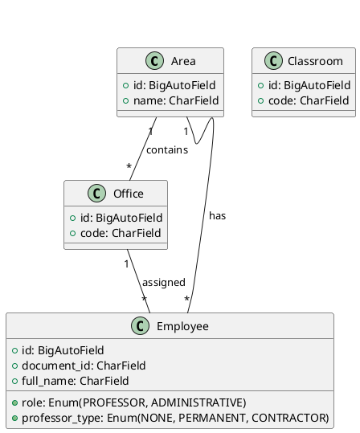

Cambridge School API (Django + DRF)

Quickstart

1. Create and activate venv, install deps

```bash
python3 -m venv ~/cambridge_env
source ~/cambridge_env/bin/activate
pip install -r requirements.txt
```

2. Run migrations and server

```bash
python manage.py migrate
python manage.py runserver
```

API

- `GET /api/areas/` CRUD for areas
- `GET /api/offices/` CRUD for offices
- `GET /api/classrooms/` CRUD for classrooms
- `GET /api/employees/` CRUD for employees
- `GET /api/reports/areas_employees/` report for areas with employee list and counts

Models (UML)



Notes

- SQLite is used by default.
- Admin site is enabled to manage data quickly.

